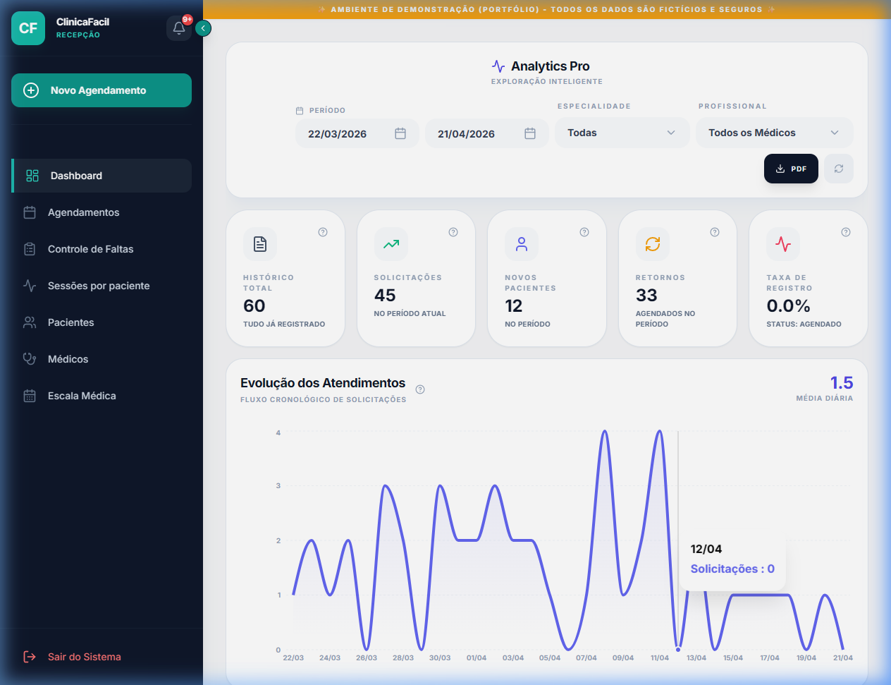

# 🏥 ClinicaFacil: Sistema de Gestão Inteligente (Versão Portfólio)

Sistema completo de gestão hospitalar focado em substituir fluxos manuais por automação, organização e agilidade. Desenvolvido para resolver problemas reais de uma clínica, com foco em experiência do usuário e robustez técnica.

---

## 📸 Preview do Sistema

---

## 🔗 Demonstração Rápida
**Acesse agora:** [https://portfolio-clinicafacil.vercel.app](https://portfolio-clinicafacil.vercel.app)

> [!IMPORTANT]
> **DICA PARA RECRUTADORES**: No login, utilize o botão **"Acesso para Recrutadores"** para entrar instantaneamente com dados de demonstração já preenchidos e visualizar as métricas do sistema em funcionamento.

---

## 🚀 Funcionalidades e Diferenciais

### 🗓️ Gestão de Agendamentos e Escalas
- **Controle de Escala Médica**: Gerenciamento de disponibilidade, horários e bloqueios.
- **Validação de Conflitos**: Algoritmo que impede duplicidade de marcações e choques de horário.
- **Fila SUS vs Particular**: Filtros automáticos baseados nas regras de negócio da unidade.

### ⚙️ Regras de Negócio e Inteligência (O Diferencial)
- **🛡️ Sistema de Strikes**: Monitoramento de presença com bloqueio automático após 2 faltas injustificadas.
- **🎓 Alta Blindada**: Bloqueio inteligente de novos agendamentos para especialidades concluídas.
- **📊 Gestão de Sessões**: Cálculo automático de sessões autorizadas vs. utilizadas, com controle financeiro integrado.

### 💰 Gestão Financeira e Faturamento
- **Fluxo de Caixa**: Registro de pagamentos via Cartão, Dinheiro e PIX.
- **Relatórios de Produção**: Separação automática para facilitar repasses e prestação de contas.

### 💬 Comunicação e UX
- **Integração WhatsApp**: Botão de contato direto com o paciente a partir de qualquer registro.
- **Cópia Rápida**: Facilidades de UI para copiar nomes, CPFs e telefones com um clique.

---

## 🧠 Engenharia e Stack Tecnológica
- **Frontend**: React 19 + TypeScript + Vite.
- **Backend/DB**: Supabase (PostgreSQL) com suporte a Realtime.
- **Segurança**: Rigorosa implementação de **Row Level Security (RLS)** no banco de dados.
- **Auditoria**: Logs completos de alterações (Audit Trail) via triggers SQL.

---

## 👨‍💻 Autor
**Lucas Souza**
- Desenvolvedor com foco em soluções Fullstack e Arquitetura de Sistemas.
- [LinkedIn: souzaeulucas](https://www.linkedin.com/in/souzaeulucas/)

---
Este projeto demonstra competências avançadas em desenvolvimento Fullstack, arquitetura de banco de dados e resolução de problemas reais de negócio.
